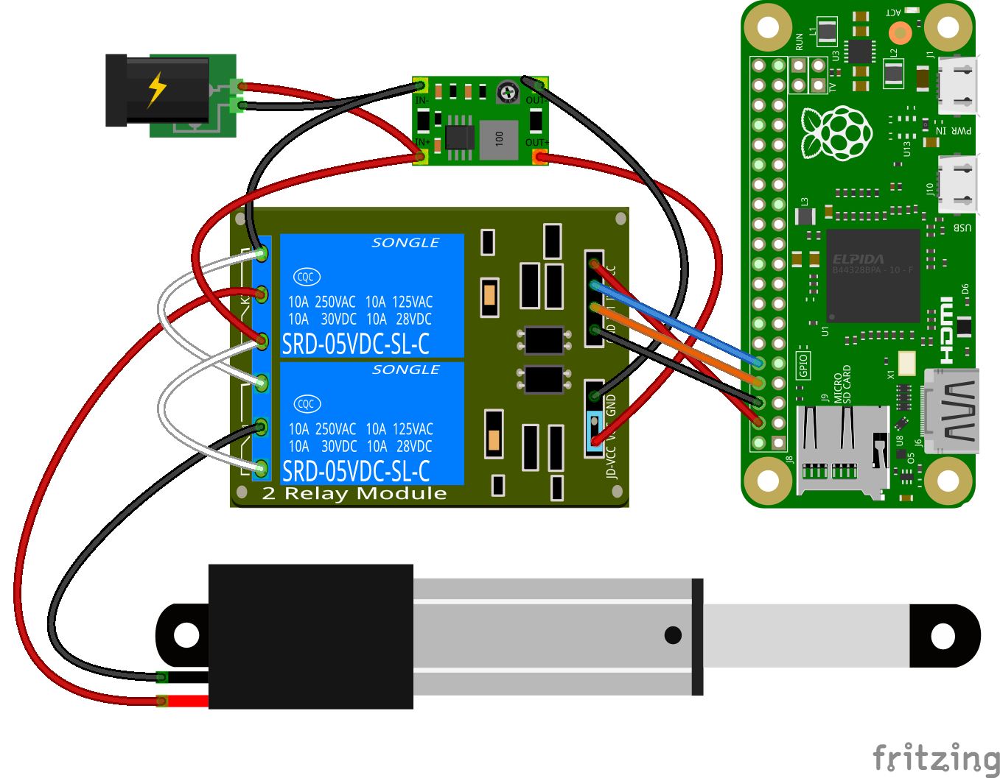
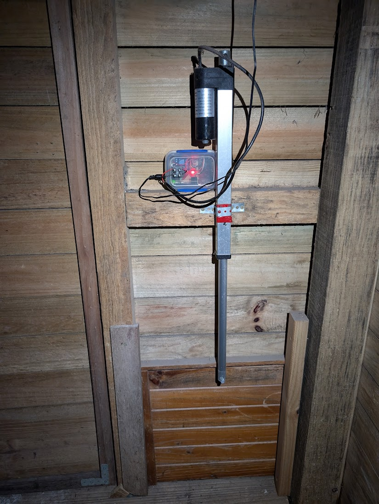
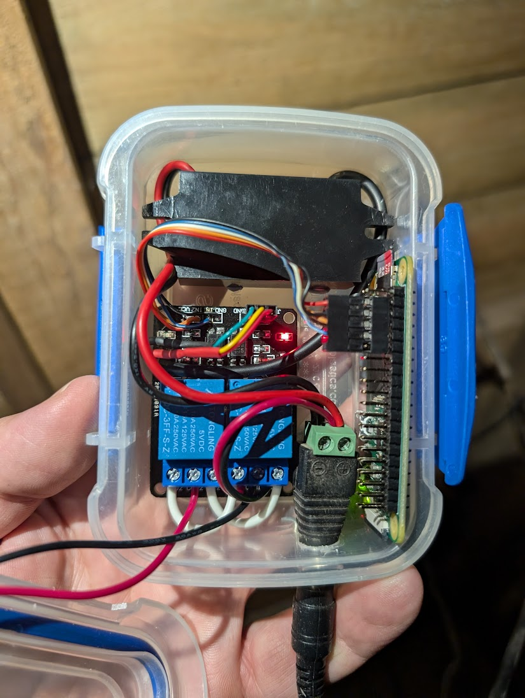
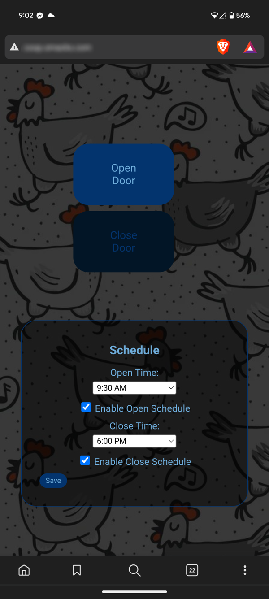

# A Pi-Powered Coop Door Controller 


This is a simple door controller running on a Pi Zero to allow ad-hoc operation and scheduling of a coop door.


# Requirements
 - [Raspberry Pi Zero](https://core-electronics.com.au/raspberry-pi-zero-w-wireless.html)
 - Generic 12V power supply
 - [12v to 5v step down converter](https://core-electronics.com.au/buck-converter-6-20v-to-5v-3a.html)
 - 12v linear actuator with built in end stops (cheap on eBay)
 - [2 channel relay board](https://core-electronics.com.au/5v-2-channel-relay-module-10a.html)
 - An old plastic box
 - A coop with chickens




<p align="center">
  <a href="doc/img/door.jpg"></a>
  <a href="doc/img/controller.jpg"></a>
</p>

<p align="center">
  
</p>


## Quickstart
If you have built the unit as per the above instructions, you can simply install docker-compose and run
```bash
curl -s https://raw.githubusercontent.com/lmacka/coopi/main/docker-compose.yaml | docker-compose -f - up -d
```

So long as docker is set to start at boot, the application will come back after restarts.


