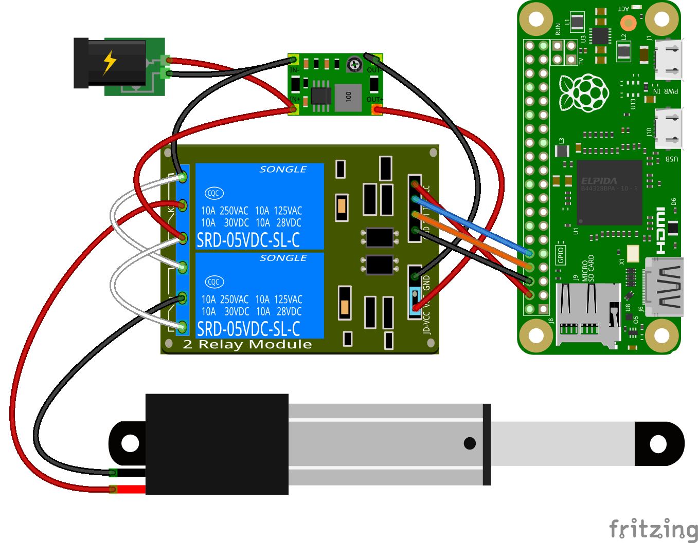
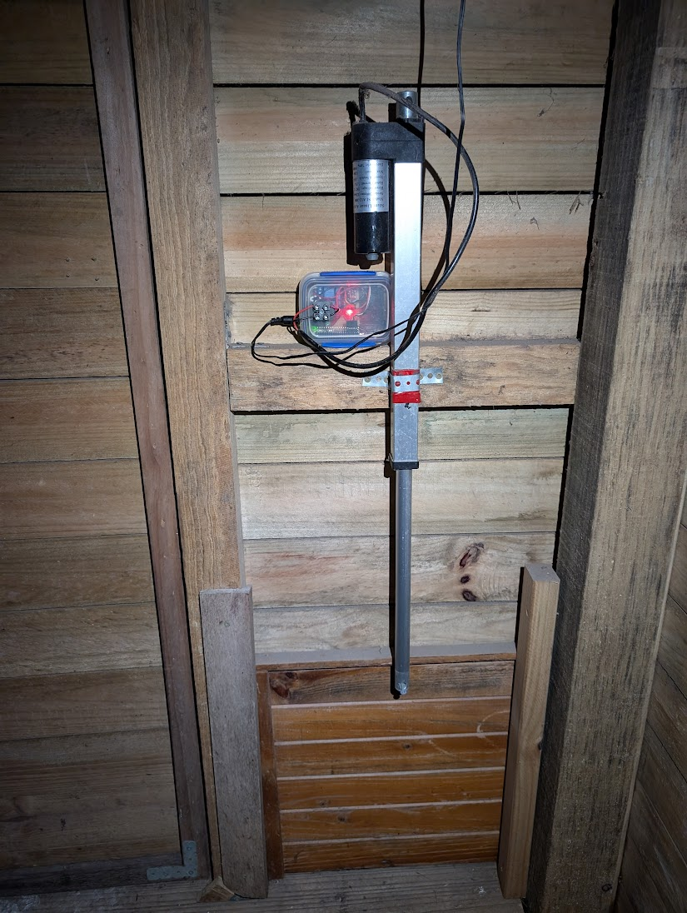
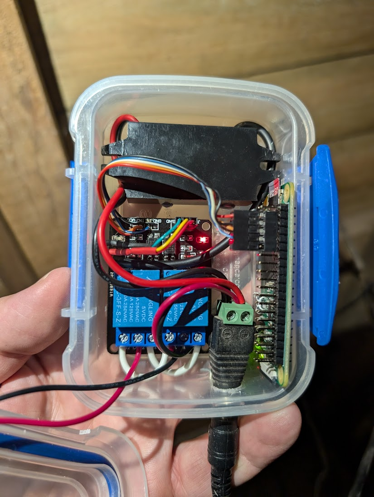
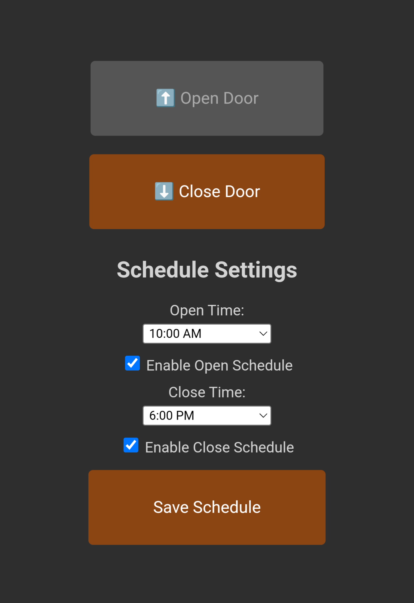

# A Raspberry Pi in a Chicken Coop


This is a simple door controller running on a Pi Zero to allow ad-hoc and scheduling of coop door operation.


# Requirements
 - [Raspberry Pi Zero](https://core-electronics.com.au/raspberry-pi-zero-w-wireless.html)
 - Generic 12V power supply
 - [12v to 5v step down converter](https://core-electronics.com.au/buck-converter-6-20v-to-5v-3a.html)
 - 12v linear actuator with built in end stops (cheap on eBay)
 - [2 channel relay board](https://core-electronics.com.au/5v-2-channel-relay-module-10a.html)
 - An old plastic box
 - A coop with chickens




<p align="center">
  <a href="static/img/door.jpg"></a>
  <a href="static/img/controller.jpg"></a>
</p>


## Quickstart
To get started with the door controller software, follow these steps:

1. Install the necessary dependencies. You can do this by running the following command:

    ```bash
    sudo apt-get install nginx python3-flask python3-rpi.gpio
    ```

2. Next, navigate to the `extras/` directory. You may need to modify these files to suit your environment.

3. Copy the system configuration files to the appropriate locations. For example, you can use the following commands to copy the files:

    ```bash
    sudo cp extras/nginx.conf /etc/nginx/sites-enabled/default
    sudo cp extras/config.service /etc/systemd/system/coopi.service
    sudo systemctl daemon-reload
    ```

    Make sure to replace `/home/pi/coopi` with the actual path to your project's directory.

4. Once the files are copied, open the `config.py` file and configure it according to your needs. This file contains various settings for the door controller, such as actuator cycle time and GPIO pin assignments.

5. After configuring `config.py`, restart nginx to apply the changes:

    ```bash
    sudo systemctl enable nginx
    sudo systemctl start nginx
    sudo systemctl enable coopi
    sudo systemctl start coopi
    ```
6. Browse to http://your-ip to access the door controller web UI.

<p align="center">
  
</p>